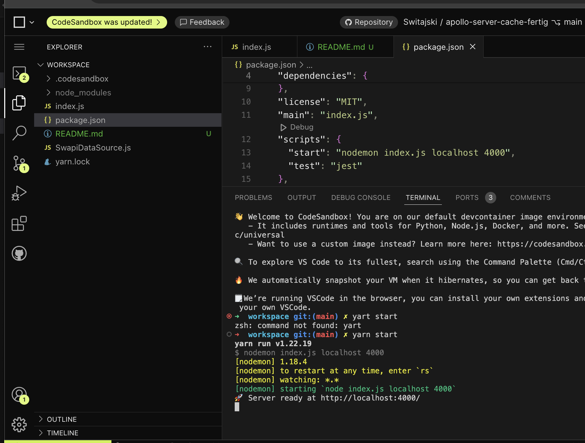
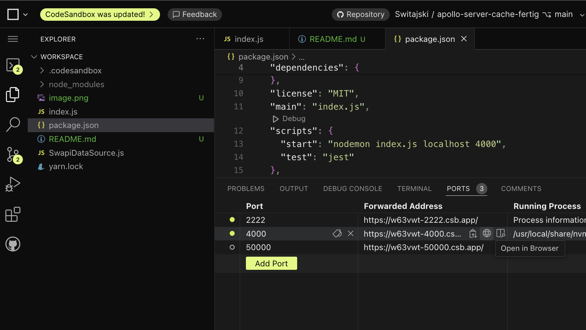
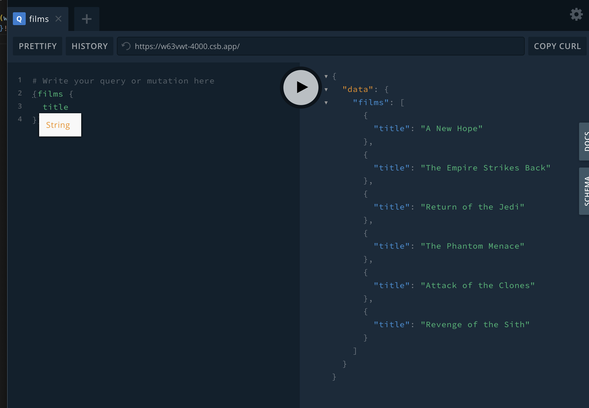

# apollo-server-cache

Code to Cegeka's tech talk about GraphQL https://www.youtube.com/watch?v=9gilc39zUOE&t=43s

published via codesandbox.io

## get started

Open codesandbox io: https://codesandbox.io/p/github/Switajski/apollo-server-cache-fertig/main

Start apollo server with GraphQL via `yarn start`

Browse to prompt via clicking on url of running node process

Query all films

